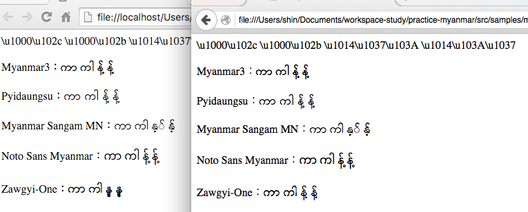
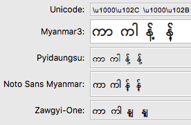
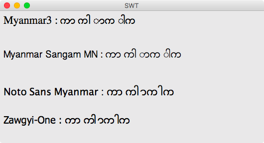
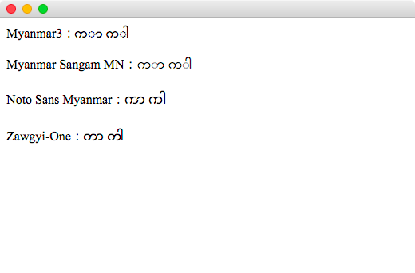
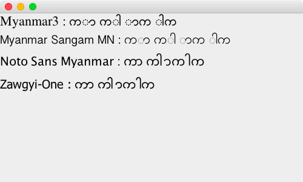
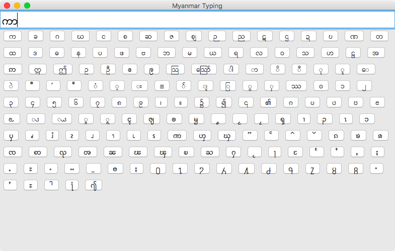
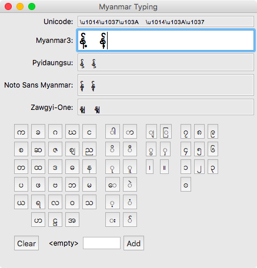
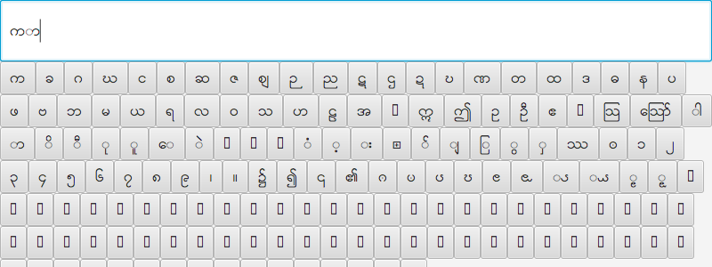

# practice-myanmar

### Rendering Testing
Browser can show MM unicode font correctly.
ブラウザでのみ正確に表示できる。
&#x1000;&#x102c;  &#x1000;&#x102b;  &#x1014;&#x1037;&#x103A;    &#x1014;&#x103A;&#x1037;

#### Using HTML on Chrome and Firefox

#### Using SWT

#### Using Java FX

#### Using Java FX with WebView

#### Using Swing

### Myanmar Unicode

http://unicode.org/charts/PDF/U1000.pdf

### Prototype Typing Software for Myanmar font

#### Using SWT

#### Using SWT with WindowBuilder

#### Using Java FX

