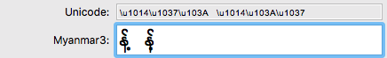
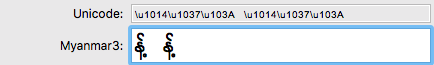
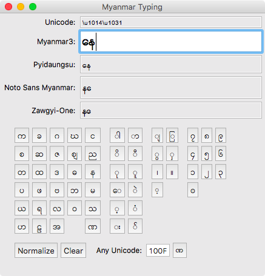
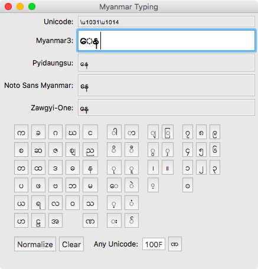
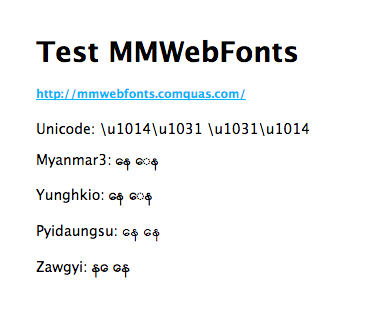

# practice-myanmar

### Myanmar Unicode

http://unicode.org/charts/PDF/U1000.pdf


### Normalization

We need ICU(International Components for Unicode) normalization for correct rendering.

http://site.icu-project.org/

This sample uses icu4j-56_1.jar.

```
String normalizeStr = Normalizer2.getNFDInstance().normalize(text.getText());
```

##### Wrong sorting (SWT rendering)



##### Normalized (SWT rendering)



### Prototype Typing Software for Myanmar font

#### SWT with WindowBuilder


-----

### Rendering Testing

#### Rendering on Chrome and Firefox


#### Rendering on SWT


#### Rendering on Java FX

#### Rendering on Java FX with WebView

#### Rendering on Swing


-----

### Others

#### SWT prototype


#### Java FX prototype


-----

### Sample Font problems

#### \u1014\u1031



#### \u1031\u1014



### MMWebFonts Test
```html
<!DOCTYPE html>
<html>
<head>
<title>Test MMWebFonts</title>
<link rel='stylesheet' href='/stylesheets/style.css' />
<link rel="stylesheet" href='http://mmwebfonts.comquas.com/fonts/?font=myanmar3' />
<link rel="stylesheet" href='http://mmwebfonts.comquas.com/fonts/?font=pyidaungsu' />
<link rel="stylesheet" href='http://mmwebfonts.comquas.com/fonts/?font=zawgyi' />
<link rel="stylesheet" href='http://mmwebfonts.comquas.com/fonts/?font=yunghkio' />
<style type="text/css">
.m3 { font-family:Myanmar3; }
.Pyidaungsu { font-family:Pyidaungsu; }
.Zawgyi { font-family:Zawgyi-One; }
.Yunghkio { font-family:Yunghkio; }
</style>
</head>
<body>
<h1>Test MMWebFonts</h1>
<h5><a href="http://mmwebfonts.comquas.com/">http://mmwebfonts.comquas.com/</a></h5>
<p>Unicode: \u1014\u1031  \u1031\u1014</p>
<p>Myanmar3: <span class="m3">နေ  ေန</span></p>
<p>Yunghkio: <span class="Yunghkio">နေ  ေန</span></p>
<p>Pyidaungsu: <span class="Pyidaungsu">နေ  ေန</span></p>
<p>Zawgyi: <span class="Zawgyi">နေ  ေန</span></p>
</body>
</html>
```

